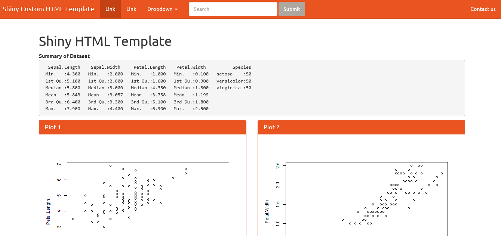

# Rshiny html template
An R Shiny HTML Template based on United Bootstrap theme for Shiny Beginners to get started soon

**What's this about**:

RShiny offers this flexibility of integrating R code with a HTML Template with *htmlTemplate()* that's similar to MVC architecture  where the R code is more about Data Manipulation and Modelling while the HTML code takes care of the UI (Front-end / Layout). This is a like *Get Started* Code for those who want to use this *htmlTemplate()* in their Shiny UI Section. 

**Why**:

While Rstudio reference article helps with a html template, that is without any css (style) hence to get started with that, a bootstrap based template would help a lot. Hence this template.

**How to use this code**:

* Download this repo and unzip/extract (if zip is downlaoded)
* Open the app.R code in your RStudio and Run the App

**Reference:** [https://shiny.rstudio.com/articles/templates.html](https://shiny.rstudio.com/articles/templates.html)

**Package Dependencies:**

* library(shiny)

Courtesy: [United Bootstrap Template](https://bootswatch.com/united/)

Sreenshot:

